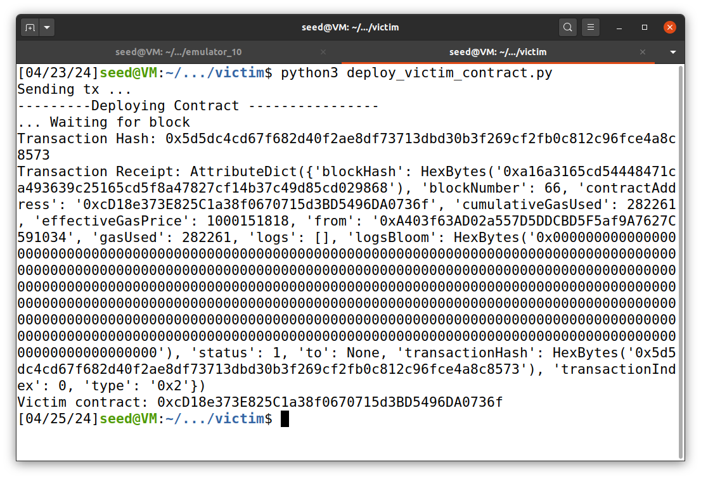

# Reentrancy Attack Lab

The objective of this lab is to have a hands-on experience with the reentrancy attack, which was a big deal in Ethereum's early days due to the DAO hack. Through two smart contracts, one vulnerable (the victim contract) and one for the attack, we could simulate the entire attack process using the SEED emulator with an Ethereum blockchain.

# Task 1.a: Compiling the Contract

To begin, we compile the victim smart contract using the following command:

```bash
solc-0.6.8 --overwrite --abi --bin -o . ReentrancyVictim.sol
```

This step generates the ABI and bytecode required for deploying the contract.


# Task 1.b: Deploying the Victim Contract

The next step involved deploying the victim contract onto the blockchain. This is accomplished by running the script `deploy_victim_contract.py`.



# Task 1.c: Interacting with the Victim Contract

To complete the setup of the victim contract, we need to fund it with ethers. Using the contract address obtained from the previous step (`0xcD18e373E825C1a38f0670715d3BD5496DA0736f`), we deposit 30 ethers into the contract using the script `fund_victim_contract.py`.


Additionally, for testing and learning purposes, we withdraw 5 ethers from the victim contract using the script `withdraw_from_victim_contract.py`.


# Task 2: The Attacking Contract

With the victim contract set up, we proceed to deploy the attacker contract. We modified the deployment script (`deploy_attack_contract.py`) to use the correct victim address.


The deployed attacker contract address is: `0xE4f431062358923783bc63Ba7bC0BF232AFd9f99`.

# Task 3: Launching the Reentrancy Attack

Finally we can run the attack by depositing 1 ether to the victim contract `launch_attack.py`


And if we run the `get_balance.py` script with the correct addresses, we can see that the attackers stole the victim ethers.


**Explanation**: The withdrawal function allows the attacker to recursively withdraw ethers before his contract's state is updated, allowing reentry and consequently drain the funds.

```js
function withdraw(uint _amount) public {
    require(balances[msg.sender] >= _amount);

    (bool sent, ) = msg.sender.call{value: _amount}(""); ➁
    ...

    balances[msg.sender] -= _amount; ➂
}
```

The recursion will start in the line ➁ but the state is only updated in the line ➂

Basically the attacker withdraws 1 ether, that will execute the fallback() function on the attacker contract:

```js
fallback() external payable {
    if(address(victim).balance >= 1 ether) { ➃
        victim.withdraw(1 ether);
    }
}
```

Which will call withdraw again and so on.

As we will see in the next task the solution is to invert the lines order.

# Task 4: Countermeasures

In this final task, we repeated the entire process but changing the victim withdraw function. After depositing 30 ethers into the victim contract and attempting to execute the attack, it failed as we expected.

```js
function withdraw(uint _amount) public {
    require(balances[msg.sender] >= _amount);

    balances[msg.sender] -= _amount;

    (bool sent, ) = msg.sender.call{value: _amount}("");
    ...
```

In the image below, we executed the `get_balance.py` script after the attack script. We can see that the first ether was successfully deposited into the attacker contract, however, the victim contract remained unaffected.


Changing the order of the lines, the first check `require(balances[msg.sender] >= _amount);` will not pass after the withdraw is called again by the attacker contract.

# Authors

G1:

- Alexandre Nunes (up202005358)
- Fábio Sá (up202007658)
- Inês Gaspar (up202007210)
