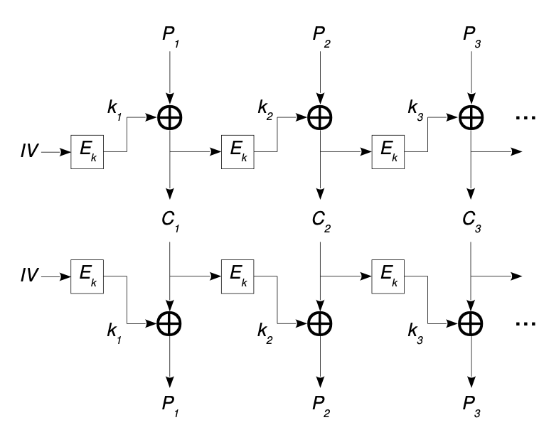
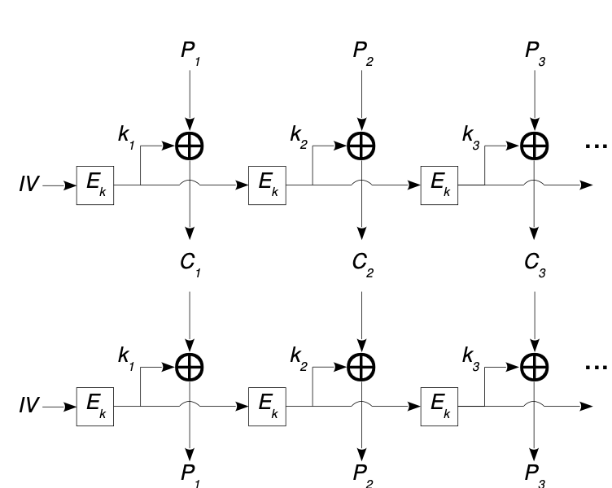
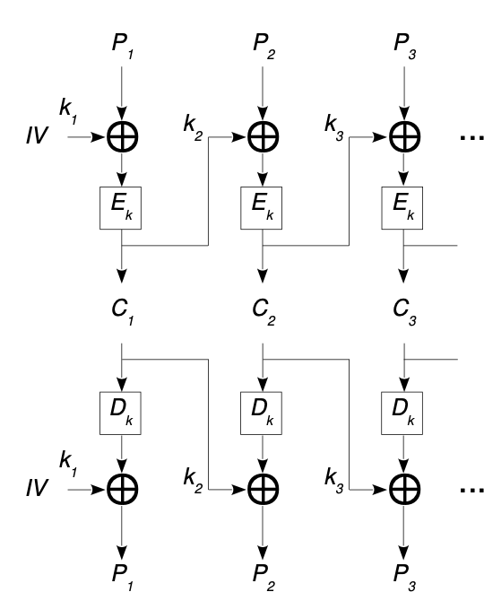
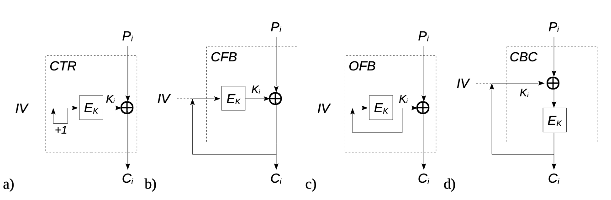

# Cryptography

**Cryptographers** tentam proteger e restringir os métodos de acesso, enquanto os **cryptanalystis** tentam quebrar esses métodos para validar a segurança do sistema.

## Classification of cryptographic systems

### On the secret

Através de secrets, que podem ser:

- `Secret algorithm`: em aplicações fechadas (militares, comerciais), não recomendadas segundo a literatura porque uma vez descoberto o algoritmo não há muito a fazer;
- `Secret keys`: usadas em todo o lado, recomendadas pela literatura porque qualquer erro é só trocar a(s) chave(s);

Em termos de Secret Keys, podem ser:

- `Simétricas`: eficientes, para grandes quantidades de dados, no entanto combinar chaves iguais em vários endpoints pode tornar-se um problema, pelo que é recomendada em sistemas fechados;
- `Assimétricas`: necessitam de uma computação pesada, não adequada para grandes quantidades de dados, troca simples de chaves públicas, pelo que é seguro utilizá-lo em ambientes abertos;

### On the method

Usadas para longos conjuntos de texto, que são processados em bloco:

- `Streaming`: cada bloco é (de)cifrado segundo um conjunto de chaves diferentes, como o RC4 ou OTP. É difícil armazenar e proteger esta quantidade de chaves;
- `Block`: 
    - `Pure`: cada bloco é (de)cifrado com a mesma chave, como o AES, RSA, SHA-2, SHA-3;
    - `Mixed`: cada bloco é (de)cifrado com uma chave virtual, que é composta de uma chave original mais um incremento diferente por bloco;

### On the purpose

- `Bidirecional`: simétrica (confidencialidade) ou assimétrica (autenticação e confidencialidade); 
- `Unidirecional`: para autenticação e integridade;

## Criptographic Keys

Uma chave é um conjunto de dados necessários para operações criptográficas, na sua maioria secreta, difícl de memorizar e produzida matematicamente / com recurso a algoritmos. Podem ser chaves:

- `Pessoais`: para autenticação, como as public-keys, com baixa eficiência e longa longevidade;
- `De sessão`: para confidencialidade nos canais de comunicação, como as chaves partilhadas, com alta eficiência e baixa longevidade;

### Digital Certificate

Documento que mapeia uma entidade a uma chave pública. Este documento é assinado por uma entidade confiável (*CA - Certificate Authority*) comum aos endpoints que poderão estar em comunicação.

## Protections

### Secure Channels

Canal de comunicação criptograficamente segura entre duas entidades, permitindo:

- `Authentication`: para uma comunicação genuína;
- `Integrity`: qualquer alteração dos dados trocados é detectada;
- `Confidentiality`: os dados são entendidos apenas pelos destinatários;

Chaves simétricas com longa duração são complexas e pouco seguras de manter ou trocar. Por outro lado, operações com chaves assimétricas são computacionalmente pouco eficientes. Assim, a solução mais usada é uma mistura das duas abordagens:

- A partilha da chave simétrica é feita a partir de chaves assimétricas;
- Depois da troca, as mensagens e documentos são cifrados com recurso à chave simétrica;

Cifras simétricas não impedem a repudiação, pelo que se usam `MAC/MIC` (*Message Authentication or Integrity Code*):

- É um hash resultante da concatenação da mensagem original com uma chave secreta;
- Envia para o destinatário o hash e também a mensagem;
- O receptor verifica a integridade da mensagem, usando a própria chave;

Uma forma mais segura é usar o `HMAC` (*Hashed Messafge Authentication Code*), que usa a parte esquerda e direita da chave em separado, que pode ser menos eficiente em contrapartida.

### Digital Signatures

Ataques são possíveis quando dois ou mais digital signatures possuem o mesmo hash/fingerprint.

### Distribuição de documentos de forma segura

O emissor tem de enviar simultaneamente:

- O documento;
- A assinatura digital do documento;
- Um digital certificate da assinatura do documento;

A recepção consiste na verificação da integridade do documento, com base na assinatura e do digital certificate gerado.

No entanto a proteção de confidencialidade não garante necessariamente de uma forma geral uma proteção de integridade.

### Attack Models

Especificação do tipo de acesso o criptoanalista tem quando tenta quebrar o sistema. Pode conhecer o texto original ou apenas a cifra.

### Criptographic Models

É a descrição formal das propriedades de segurança e assumptions do sistema protegido. Aqui o sentido de `random` verdadeiro é importante, não baseado em algoritmos mas sim em algo físico ou com seeds físicas. O nível de random pode ser medido através da captura da frequência ou do cálculo da entropia teórica do output.

### General enciphering schemes

Conjunto de algoritmos e protocolos para transformar texto em cifras, de tal modo que pessoas não autorizadas não conseguem reverter a alteração. Há três tipos essenciais:

- `Deterministic`: a mesma cifra é sempre criada, independentemente do texto ou da chave de entrada;
- `Probabilistic`: diferentes cifras são quase sempre diferentes;
- `Format preserving`: a cifra e o texto original têm o mesmo formato;
- `Perfect secrecy`: a cifra não revela qualquer informação sobre o texto original; 
- `Semantic Security`: a cifra pode revelar algumas informações sobre o texto original;
- `Indistinguishable`: não é revelada qualquer informação que permita distinguir que cifra é produzida por um conjunto de textos;
- `Malleable`: uma cifra produzida por um texto desconhecido pode ser usada em conjunto com outra cifra para decrifrar algo relacionado ao texto original;
- `Homomorphic`: as cifras sofrem computações de modo a que, quando decifradas, têm relação com o texto original. Por exemplo RSA com módulo N;
- `Perfect forward secrecy`: mesmo conhecendo key session, não é possível decifrar mensagens de sessões anteriores;

### Long texts encipherment

- `Electronic Code Book`: a mesma chave é usada para cifrar todos os blocos, o que não é bom. Pode ser paralelizado;

- `CTR, Counter Mode`: apenas uma chave é usada, mas cada bloco faz uma transformação à chave antes de a usar, como um simples incremento, de forma a ser virtualmente diferente. Pode ser paralelizado;

- `CFB, Cipher Feedback`: a chave de um bloco N é o output da cifra do bloco N - 1. Há sempre uma seed. Apenas o deciframento pode ser paralelizado;

- `OFB, Output Feedback`: Não é possível paralelizar;

- `CBC, Cipher Block Chaining`: a chave de um bloco N é o output da cifra do bloco N - 1. Há sempre uma seed. Apenas o deciframento pode ser paralelizado;

### Padding

Técnica usada quando o número de blocos do não é completo (bytes, por exemplo) e é importante para esconder o tamanho real do texto. Consiste em:

-  preencher os blocos em branco com o número de espaços em branco que estes possuem;
- começar e acabar em 1, fazer fill dos blocos restantes com 0;

É conveniente acabar a mensagem com o número de bytes que esta possui.

## One-way cryptography

Usando hash functions, que possuem características:

- `One-way`: não há hipótese de voltar a ter o plaintext, a não ser por brute-force;
- `Compression`: produz um resultado com um tamanho fixo;
- `Collision-resistant`: dois inputs dão origem a dois outputs diferentes;

Para ficheiros grandes, é necessário proceder ao hashing iterativamente, com possível adição de padding e de um bloco final que indica o comprimento do documento original.

Usando brute force, o algoritmo deve ser resistente a:

- 2^(n/2) - for strong collision attacks;
- 2^n - for weak collision attacks;

#### SHA-3

Usa **sponge construction**: um input M é dividido em vários blocos de R bits depois da fase de padding. Depois é criado um output com a concatenação dos blocos produzidos no passo anterior. O parâmetro C (ou seja, o output é na forma 2^C), determina o grau de segurança contra collision attacks. Para o mesmo valor B = R + C, se aumentarmos R significa um menor tempo de execução (menos blocos a processar) e uma menor segurança dado o tamanho do output.

## Integrity & Confidentiality protection

Confidencialidade não garante integridade das mensagens trocadas, pelo que algumas verificações devem ser adicionadas:

- Assinaturas
- Fingerprints
- Authenticated Encipherment Protolos

### External combinations

#### 1 - Encrypt then MAC

#### 2 - Encrypt and MAC

#### 3 - MAC then Encrypt

